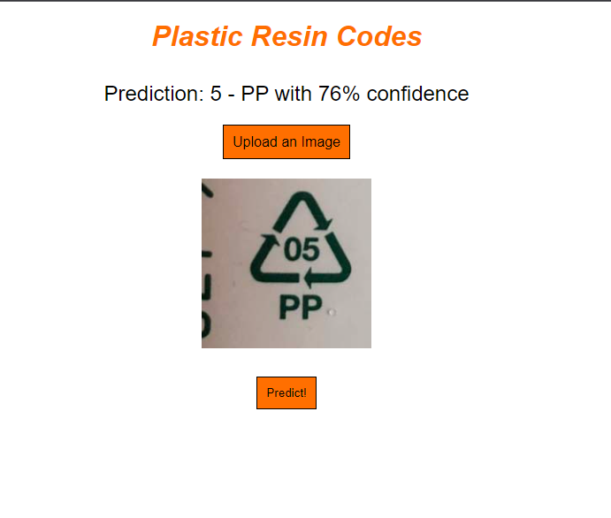

# tensorflow-recycling

Have you memorized every recycling symbol on every product out there? Yes? Oh... well congratulations because I definitely did not prior to this project. If you answered no and you're also trying to become an upstanding citizen of this planet, following along in our journey. [Allen](https://github.com/average-alien) and I will be making use of Tensorflow to scan images for recycling symbols to categorize the containers and learn how to dispose of them properly.

## User Stories

* As a user, I want to be able to upload a photo containing a recycling symbol.
* As a user, I want to be shown the category the symbol belongs and how to recycle the container associated with it.

## Wireframes

## Screenshots (WIP)

## Routes

| Path | Description |
| ---- | ----------- |
| `/` | Landing page where users can upload photos for our model to make predictions on |
| `/model` | For serving our model to the frontend client |

## Techstack

* Python
* Tensorflow
* Keras
* JavaScript
* Node.js
* Express
* HTML5 (EJS)

## Technology Usage

A tensorflow model for recycling symbol classification was made using the combination of Python and tensorflow + keras. The *tentative* final version of the model was built upon on the MobileNet model. An express server made to run on the local machine was written in JavaScript, supported by Node.js, and is served HTML5 views via EJS.

## Installation Instructions

### Local web app usage

* Fork and clone this repository
* Navigate to the `web_app` folder in Zsh
* Run `npm install` to install node dependencies
* Ensure nodemon is installed globally
    * If not, run `npm install -g nodemon` (or `npm install --save-dev nodemon` for local installation)
* Run `nodemon` to start the application (or `npx nodemon` for local installations)
* Navigate to http://localhost:8000/ to interact with the web app

### Testing the tensorflow files

* Fork and clone this repository
* Navigate to the `tensorflow` folder in Zsh
* Run `python3 -m venv env` to create a virtual environment
* Run `source env/bin/activate` to enter virtual environment
* Run `pip3 install -r requirements.txt` to install virtual environment dependencies
* Run `python3 [FILE_HERE]` to start training the model and outputting the predictions set in the files
    * Recommended: `python3 fashion-mnist.py`
    * Our *tentative* final model: `python3 mobilenet-recycling-AT.py` (GPU acceleration access recommended/required)

## Minimum Viable Product (MVP) Goals

* [x] Tensorflow model that can *semi*-accurately identify symbols used for recycling
* [x] TF model that can *semi*-accurately differentiate between the various symbols

## Stretch Goals

* [x] Design user interface on a web app for public interactions with TF model
* [ ] Upload images via camera access
* [ ] Scan for symbols with video and stop upon symbol recognition
* [ ] Mobile responsiveness
* [ ] Mobile app version (Flutter?)

## Daily Sprints Draft

## Approach Taken

We didn't have a ton of dedicated project work time on the first day (Tuesday), so we spent most of it doing general research into the tensorflow framework and how keras is related to it. By the time I actually started writing some code, I was just following a "getting started" guide on the tensorflow website to make a model and run predictions on it with a preselected dataset. Afterwards, I went through another guide to figure out how to make a model with a custom dataset instead, since tensorflow's collection of datasets did not have anything for our specific needs.
To get started on training a model we first needed a dataset of recycling symbols, and since the plastic resin codes are the most distinct, we decided to get started by throwing whatever we found on google images into folders labeled 1-7 for the coded numbers. After some searching around online, I stumbled across an [old project from 2019](https://www.kaggle.com/datasets/piaoya/plastic-recycling-codes) with the same objective as ours. After adding in the images from that project, we had 600+ images to train our model on via batch learning. Following this, we went on to fix problem after problem and trained our model again and again using different combinations of Sequential keras layers, data augmentation, batch size, image size, training-validation splits, epochs, and pre-trained models like MobileNet. The bulk of our learning was in this grueling period of experimentation, trying to slowly increase our model's prediction accuracy since my laptop, a 2017 Macbook Air, would take several minutes to up to hours for some training sessions; it regularly overheated and drastically slowed down at times.
We spent as much time as we could justify to get a decent model trained with the data we had, so that we could save it and use it in a demonstration to show off our work. While Allen worked on getting a web app version set up, I tried going through tensorflow's Android Studio deployment setup to no luck. I then switched over to using flutter and got as far as adding the ability to take pictures and loading in the model plus interpreter with the help of firebase. After getting stuck with the flutter plugin I was using and with the end of the project sprint closing in, I was unable to convert pictures taken to TensorImages for the interpreter to run classification on. I shifted the rest of my focus to helping debug the web version and making sure that side of things was ready for presentation.

## Major Hurdles and Unsolved Problems

Our first major hurdle was really poor model prediction accuracies. I spent a whole day trying to figure out what the problem could be, which required researching and debugging. The debugging part took really long since each time I ran a file, the training would take quite a while as mentioned before. One step of progress we made was after I displayed our dataset via matplotlib's submodule pyplot. This is where I realized that all the files we had in our dataset that weren't .jpg or .jpeg files were interpreted as tensor representations of black squares. Realizing that tensorflow/keras only supported those two file types, we deleted everything else including .png, .svg, and .webm files. This improved our model significantly as the problem files are now gone.
The next hurdle we faced was overfitting. After many epochs, our model began to easily classify images it's already seen, but was unable to accurately identify new images. To solve this, we first tried adding a dropout layer in the sequential model, then data augmentation. With neither boosting our results significantly, we spent a lot of time tinkering with other combinations of Seqential layers, image size, training-validation splits, etc. We also shifted gears to using MobileNet as our base model, but the problem of overfitting was still there. We concluded, with additional third-party advice, that we would not be able to improve our model any further with the relatively small and sometimes not-very-clear dataset that we have.
A personal hurdle of mine was trying to set up our model onto a mobile application with tensorflow's Android Studio guide. The [documentation](https://www.tensorflow.org/lite/android/quickstart) on it wasn't very clear so I switched over to using flutter + firebase. This lead to a similar problem with Android Studio being me having to learn Dart in flutter vs Kotlin in Android Studio. I slowly made some progress by adding the functionalities mentioned in the above section, but a weekend proved to be not enough time to finish the mobile implementation. The unsolved problem remains that I was unable to figure out how to convert xFile/CameraImage file types to proper TensorImage types for the loaded-in interpreter to run predictions on.
