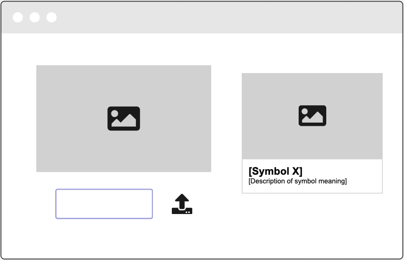
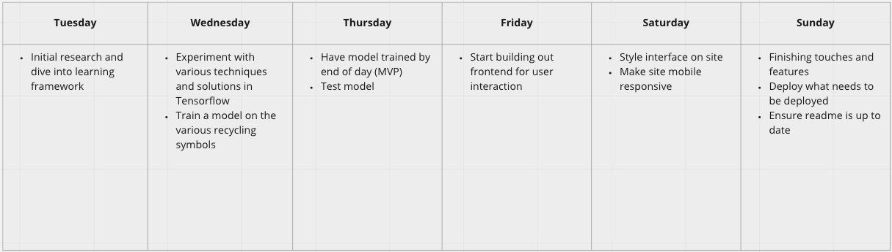

# tensorflow-recycling

Have you memorized every recycling symbol on every product out there? Yes? Oh... well congratulations because I definitely did not prior to this project. If you answered no and you're also trying to become an upstanding citizen of this planet, following along in our journey. [Allen](https://github.com/average-alien) and I will be making use of Tensorflow to scan images for recycling symbols to categorize the containers and learn how to dispose of them properly.

## User Stories

* As a user, I want to be able to upload a photo containing a recycling symbol.
* As a user, I want to be shown the category the symbol belongs and how to recycle the container associated with it.

## Wireframes

## Techstack

* Python
* Tensorflow
* Keras

## Minimum Viable Product (MVP) Goals

* [ ] Tensorflow model that can accurately identify symbols used for recycling
* [ ] TF model that can accurately differentiate between the various symbols

## Stretch Goals

* [ ] Design user interface on a web app for public interactions with TF model
* [ ] Upload images via camera access
* [ ] Scan for symbols with video and stop upon symbol recognition
* [ ] Mobile responsiveness
* [ ] Mobile app version (Flutter?)

## Daily Sprints Draft

